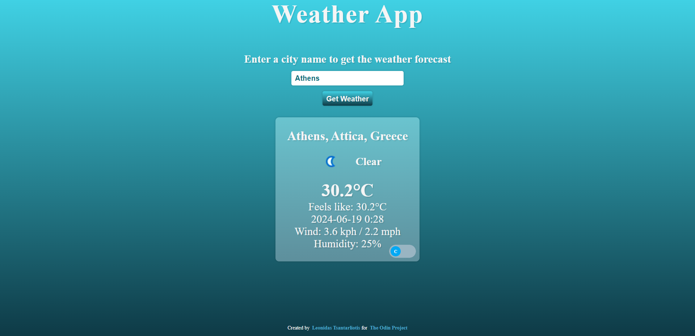

# Weather-App

Live Demo:  
https://leo-tsant.github.io/Weather-App/

## Overview

This project was created for the [Weather App assignment](https://www.theodinproject.com/lessons/node-path-javascript-weather-app) as part of [The Odin Project](https://www.theodinproject.com/) curriculum. Features a web-based application that allows users to check the current weather conditions and forecast for a specific location. This project utilizes a weather API to fetch real-time weather data and display it to the user.

## Technologies Used

-   **HTML**
-   **CSS**
-   **JavaScript (ES6+)**
-   **Webpack**
